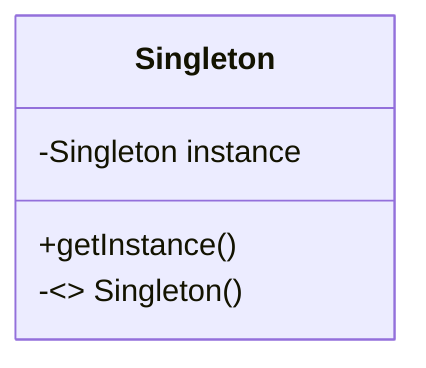

# Padrões de Projeto GOF

**SINGLETON** - utilizado quando uma determinada classe não pode ter mais de uma instância, e sim apenas uma.  O Singleton resolve por ter um atributo estático que a representa. O Singleton é responsável por criar a instância e usamos o método getInstance() para obter a instância.



**FACTORY METHOD** - método que fabrica objetos, uma fábrica. Temos um super tipo. Normalmente o SuperTipo é uma interface ou classe abstrata e temos subtipos que implementam ou herdam SuperTipo se for uma interface. Na factory teremos um método que vai ter a responsabilidade de criar um objeto dos subtipos e irá retornar o subtipo. Ele permite desacoplamento.

```mermaid
classDiagram
Factory --> SuperTipo
SuperTipo <|-- SubTipoDesconhecido1
SuperTipo <|-- SubTipoDesconhecido2

