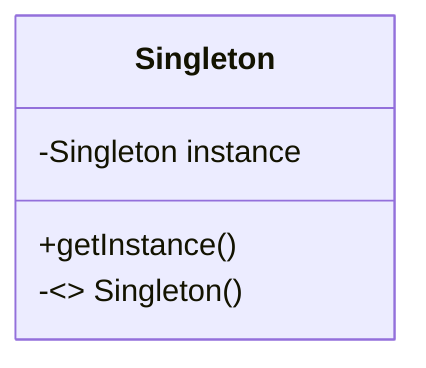

# Padrões de Projeto GOF

**SINGLETON** - utilizado quando uma determinada classe não pode ter mais de uma instância, e sim apenas uma.  O Singleton resolve por ter um atributo estático que a representa. O Singleton é responsável por criar a instância e usamos o método getInstance() para obter a instância.



**FACTORY METHOD** - O padrão de design de fábrica define uma interface (uma interface java ou uma classe abstrata) para criar o objeto e permite que as subclasses decidam qual classe instanciar. O método de fábrica na interface permite que uma classe adie a instanciação para uma ou mais subclasses concretas.Ele permite desacoplamento. Segundo o GOF (Group Of Four) o padrão Factory Method é: “Um padrão que define uma interface para criar um objeto, mas permite às classes decidirem qual classe instanciar. O Factory Method permite a uma classe deferir a instanciação para subclasses”.

```mermaid
classDiagram
Factory --> SuperTipo
SuperTipo <|-- SubTipoDesconhecido1
SuperTipo <|-- SubTipoDesconhecido2

